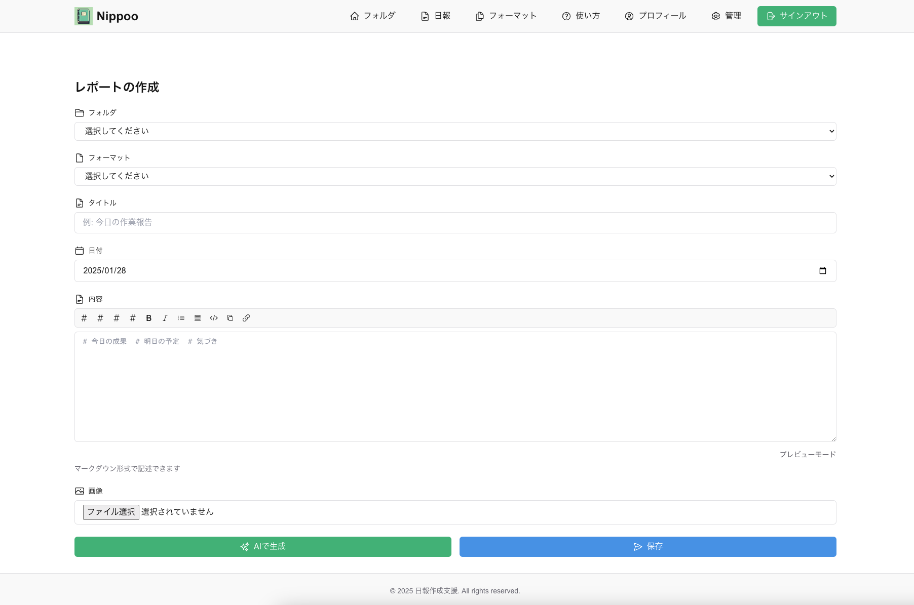

# Nippoo - LLM を活用した日報作成支援アプリケーション



## 概要

Nippoo は、LLM（Gemini）を活用して効率的に日報を作成・管理できる Web アプリケーションです。ユーザーの文体を学習し、過去の日報を参考にしながら、自然な日本語で日報を自動生成します。

## 主な機能

### 1. フォルダ管理

- プロジェクトごとに日報を整理
- フォルダごとのデフォルトフォーマット設定
- フォルダ単位でのインサイト生成

### 2. フォーマット管理

- マークダウン形式での日報テンプレート作成
- リアルタイムプレビュー機能
- フォルダへのデフォルトフォーマット設定

### 3. 日報作成

- LLM を活用した日報の自動生成
- 画像添付機能（最大 3 枚）
- マークダウンエディタ
- プレビュー機能
- インサイト自動生成

### 4. AI 支援機能

- ユーザーの文体学習
- 過去の日報を参考にした内容生成
- 画像の内容を考慮した文章生成
- フォルダごとのインサイト生成

### 5. 組織管理機能

- 階層構造（例：社長 > 部長 > 一般社員）
- 上位者による部下の日報閲覧
- 組織ごとの役職管理

## 技術スタック

### フロントエンド

- Next.js 15.1.6
- React 19.0.0
- TailwindCSS
- react-markdown（マークダウンレンダリング）

### バックエンド

- Supabase
  - 認証
  - PostgreSQL データベース
  - ストレージ（画像管理）

### AI/LLM

- Google Gemini API（Gemini は画像分析に優れているため採用）
  - 日報生成
  - 文体分析
  - インサイト生成

## プロジェクト構造

### フォルダ構造

```
.
├── app/                      # Next.js アプリケーションのルート
│   ├── admin/               # 管理者機能
│   │   ├── page.tsx         # 管理者ダッシュボード
│   │   └── roles/          # 役職管理機能
│   ├── api/                 # APIルート
│   │   ├── insights/       # インサイト生成API
│   │   ├── llm/            # LLM関連API
│   │   └── tutorial/       # チュートリアル用（文体分析用）API
│   ├── formats/            # フォーマット関連ページ
│   │   ├── create/        # フォーマット作成
│   │   └── [id]/          # フォーマット詳細・編集
│   ├── guide/             # 使い方ガイド
│   ├── profile/           # プロフィール設定
│   ├── reports/           # 日報関連ページ
│   │   ├── create/        # 日報作成
│   │   └── [id]/         # 日報詳細・編集
│   ├── signin/           # サインインページ
│   ├── signup/           # サインアップページ
│   ├── tutorial/         # チュートリアル（文体分析用）ページ
│   ├── layout.tsx        # 共通レイアウト
│   └── page.tsx          # トップページ（フォルダ一覧）
│
├── components/           # 共通コンポーネント
│   ├── common/          # 汎用コンポーネント
│   │   ├── MarkdownRenderer.tsx    # マークダウン表示
│   │   ├── MarkdownToolbar.tsx     # マークダウン編集ツール
│   │   └── TextEditModal.tsx       # テキスト編集モーダル
│   ├── formats/         # フォーマット関連コンポーネント
│   │   ├── FormatDetail.tsx        # フォーマット詳細表示
│   │   ├── FormatForm.tsx          # フォーマット作成・編集フォーム
│   │   └── FormatList.tsx          # フォーマット一覧
│   ├── purposes/        # フォルダ関連コンポーネント
│   │   ├── PurposeDeleteModal.tsx  # フォルダ削除モーダル
│   │   ├── PurposeDetail.tsx       # フォルダ詳細表示
│   │   ├── PurposeEditModal.tsx    # フォルダ編集モーダル
│   │   ├── PurposeForm.tsx         # フォルダ作成フォーム
│   │   └── PurposePage.tsx         # フォルダ一覧ページ
│   ├── reports/         # 日報関連コンポーネント
│   │   ├── DeleteReportButton.tsx  # 日報削除ボタン
│   │   ├── ReportDetail.tsx        # 日報詳細表示
│   │   ├── ReportForm.tsx          # 日報作成・編集フォーム
│   │   └── ReportList.tsx          # 日報一覧
│   ├── Footer.tsx       # フッター
│   └── Header.tsx       # ヘッダー
│
├── docs/               # ドキュメント
│   ├── ddl.sql        # データベース定義
│   ├── dml.sql        # サンプルデータ
│
├── public/            # 静的ファイル
│   └── images/        # 画像ファイル
│
├── utils/             # ユーティリティ関数
│   └── supabase/     # Supabase関連
│       ├── client.ts  # クライアントサイド用クライアント
│       └── server.ts  # サーバーサイド用クライアント
│
└── package.json      # プロジェクト設定
```

## 主要ファイルの役割

### アプリケーションコア

- `app/layout.tsx`: アプリケーション全体のレイアウトを定義
- `app/page.tsx`: トップページ（フォルダ一覧）を表示

### 認証関連

- `app/signin/page.tsx`: サインインページ
- `app/signup/page.tsx`: サインアップページ
- `app/profile/page.tsx`: プロフィール設定ページ

### 日報管理

- `components/reports/ReportForm.tsx`: 日報の作成・編集フォーム
- `components/reports/ReportDetail.tsx`: 日報の詳細表示
- `components/reports/ReportList.tsx`: 日報一覧の表示

### フォルダ管理

- `components/purposes/PurposeForm.tsx`: フォルダの作成フォーム
- `components/purposes/PurposeDetail.tsx`: フォルダの詳細表示
- `components/purposes/PurposePage.tsx`: フォルダ一覧の表示と管理

### フォーマット管理

- `components/formats/FormatForm.tsx`: フォーマットの作成・編集フォーム
- `components/formats/FormatDetail.tsx`: フォーマットの詳細表示
- `components/formats/FormatList.tsx`: フォーマット一覧の表示

### API

- `app/api/llm/route.ts`: LLM を使用した日報生成 API
- `app/api/insights/route.ts`: インサイト生成 API
- `app/api/tutorial/route.ts`: チュートリアル用 API

### 共通コンポーネント

- `components/common/MarkdownRenderer.tsx`: マークダウンのレンダリング
- `components/common/MarkdownToolbar.tsx`: マークダウン編集ツール
- `components/common/TextEditModal.tsx`: テキスト編集用モーダル

### ドキュメント

- `docs/ddl.sql`: データベース定義
- `docs/dml.sql`: サンプルデータ

### データベース構造

1. テーブル構成

- nippo_profiles: ユーザープロフィール
- nippo_purposes: フォルダ情報
- nippo_report_formats: 日報フォーマット
- nippo_reports: 日報
- nippo_images: 画像情報
- nippo_roles: 役職マスタ

## セットアップ手順

1. 環境構築

```bash
npm install
```

2. 開発サーバー起動

```bash
npm run dev
```

3. 必要な環境変数
   プロジェクトルートに.env ファイルを作成し、以下の環境変数を設定する。

- NEXT_PUBLIC_SUPABASE_URL
- NEXT_PUBLIC_SUPABASE_ANON_KEY
- GEMINI_API_KEY

4. データベースの初期化

- docs/ddl.sql を実行してテーブルを作成
- docs/dml.sql をデータ修正して実行（supabase のユーザ ID に紐づける必要があるため、AI に聞きながら実施するのをお勧めします）

## 既知の TODO

1. トランザクション管理
   画像アップロード/削除処理を含む処理がトランザクション管理になっていない。supabase で trigger を作成してトランザクション管理を行う必要がある。

- PurposeDeleteModal コンポーネント
- DeleteReportButton コンポーネント
- ReportForm コンポーネント

insights の更新がトランザクション管理になっていない。RPC にする必要がある。

- app/api/insights/route.ts の update と ReportForm の submit の処理をまとめてトランザクション管理にするべき。

2. リンク
   プロフィールページの「会社概要」「利用規約」「プライバシーポリシー」のリンクを正しく設定する必要あり

## その他

- supabase のサインイン/サインアップは(https://supabase.com/docs/guides/auth/server-side/nextjs)こちら参照
- 法人に導入する場合は、supabase のサインイン/サインアップを email ではなく他の手段にする必要があると思われる。それに伴い、DDL の profile も email が不要に。

## ライセンス
MITライセンス
